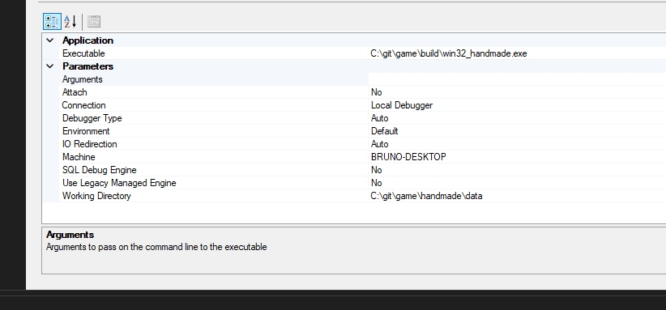

# game_from_scratch

## Resources

* https://hero.handmade.network/episode/code/day001/
* https://learn.microsoft.com/en-us/windows/win32/learnwin32/winmain--the-application-entry-point

## Build and Debug

* To build the application:

```
    cd handmade\code
    build.bat
```

* To debug the application:

```
    devenv ..\..\build\win32_handmade.exe
```

This will open visual studio, once there remember to change "Executable" and "Working Directory" on exe properties. Example:



Then just hit f11 and start debugging!

## Debugging Tools
* Press P Key to Pause
* Press L Key to start input loop and L key again to lock the loop

## Troubleshoot

If when trying to build the application, you receive the error "The input line is too long. The syntax of the command is incorrect." make sure to put the project folder as close as possible to C: and if the error persists just restart your cmd.


## Doubts / Learn

* What is Device Independent Bitmap?
* What is raster function?
* Restudy memory in OS and memory allocation in C++
* understand arrow vs point https://www.geeksforgeeks.org/arrow-operator-in-c-c-with-examples/
* Understand pitch and stride https://learn.microsoft.com/pt-br/windows/win32/medfound/image-stride (tutorial 04)
* Chandler Carruth - C++ Compiler Optimization
* Search for XInput (controller api)
* DirectSound is deprecated and replaced by XAudio2
* Search C Runtime Library
* Estudar trigonometria
* the internal declaration on functions is made so that the compiler knows that there is no linkage, everything is compiled in one file
* What is CLANG?
* MMX, SSE and SSE2 Instrinsics
* Intel Intrinsics Guide https://www.intel.com/content/www/us/en/docs/intrinsics-guide/index.html
* Galois Dream: Gropup theory and differential equations:  https://archive.org/details/galoisdreamgroup0000kuga
* C++ Bit Operations
* Linear Blend https://youtu.be/S2fz4BS2J3Y?si=6gvYyRmn9Sakj2pw
* Raymond Chen - Expert on Windows Platform

##Vectors

* Hadamard Product -> only for colors
* For moiton, we use Dot Product, Perp Dot Product and Cross Product

